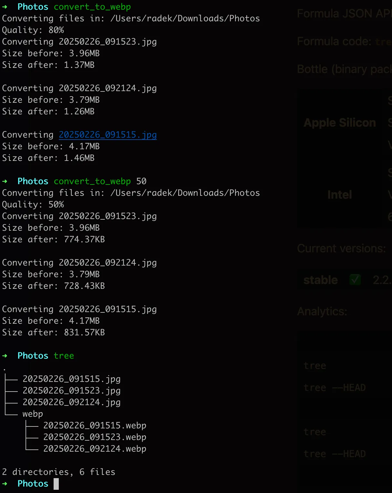

# convert_to_webp

oh-my-zsh plugin to convert `jpg` | `jpeq` to webp using webp package

## Prerequisite

1. install google [cwebp](https://formulae.brew.sh/formula/webp) convertion tool

```bash
brew install webp
```

2.  Clone this repo into [oh-my-zsh](http://github.com/robbyrussell/oh-my-zsh) plugins directory:

```bash
cd ~/.oh-my-zsh/custom/plugins
git clone git@github.com:Plesin/convert_to_webp.git
```

3.  Activate the plugin in `~/.zshrc`:

```bash
plugins=( ... convert_to_webp)
```

4. Source `~/.zshrc` to take changes into account:

```bash
source ~/.zshrc
```

## Usage

1. copy path in Finder with your photos and cd to it

```bash
cd ~/Downloads/Photos
```

2. Run the plugin with default compression

```bash
convert_to_webp
```

3. Explore the output result. If not happy with the size pass quality as param.

```bash
convert_to_webp 50
```

4. Converted files are stored in webp directory, example:

```bash
~/Downloads/Photos/webp
```

### Preview


